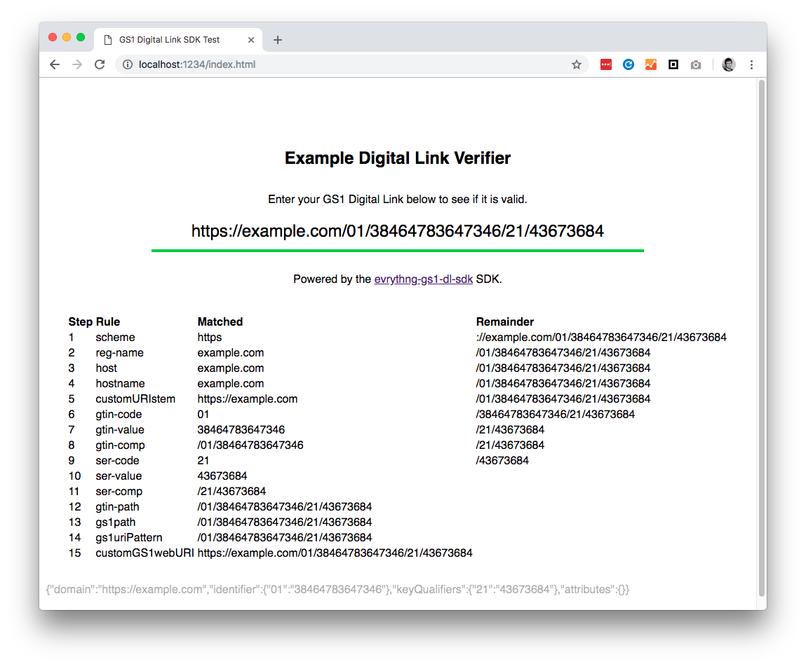

# evrythng-gs1-dl-sdk

SDK for creating, verifying, and representing/transferring GS1 Digital Links.


## Installation

1. `npm i --save evrythng-gs1-dl-sdk`
2. `require` it as shown below.


## Usage

The `DigitalLink` object can be created in three ways - with options, using 
setters, or an existing URL string. Either method of construction will produce 
the same result.


### Create with object

The object can contain the following items:

- `domain` (string) - The domain to use.
- `identifier` (object) - An object containing a single GS1 Application 
  Identifier, such as GTIN, as a key-value pair.
- `keyQualifiers` (object) - An object containing one or more GS1 Key Qualifiers
  as key-value pairs.
- `attributes` (object) - As for `keyQualifiers`, but containing GS1 Data 
  Attributes and custom data attributes.

An example is shown below:

```js
const DigitalLink = require('evrythng-gs1-dl-sdk');

const dl = new DigitalLink({
  domain: 'https://dlnkd.tn.gg',
  identifier: {
    '01': '9780345418913',
  },
  keyQualifiers: {
    '21': '43786',
  },
  attributes: {
    thngId: 'UMwxDXBdUbxgtyRaR2HBrc4r',
  },
});
```


### Create with setters

The equivalent to the object-based example above can also be constructed 
piecemeal using setters:

```js
const DigitalLink = require('evrythng-gs1-dl-sdk');

const dl = new DigitalLink();
dl.setDomain('https://dlnkd.tn.gg');
dl.setIdentifier('01', '9780345418913');
dl.setKeyQualifier('21', '43786');
dl.setAttribute('thngId', 'UMwxDXBdUbxgtyRaR2HBrc4r');
```

Setters can also be chained:

```js
const DigitalLink = require('evrythng-gs1-dl-sdk');

const dl = new DigitalLink()
  .setDomain('https://dlnkd.tn.gg')
  .setIdentifier('01', '9780345418913')
  .setKeyQualifier('21', '43786')
  .setAttribute('thngId', 'UMwxDXBdUbxgtyRaR2HBrc4r');
```


### Create from URL

A `DigitalLink` object can also be created using an existing string:

```js
const url = 'https://dlnkd.tn.gg/01/9780345418913/21/43786?thngId=UMwxDXBdUbxgtyRaR2HBrc4r';

const dl = new DigitalLink(url);
```


### URL and JSON Generation

A `DigitalLink` object can transform itself into a string URL representation:

```js
const url = dl.toString();

console.log(url);
```

It is also possible to view the object makeup of the `DigitalLink`. This can
then be used to construct the same `DigitalLink` from an object.

```js
// Get JSON representation
const jsonString = dl.toJsonString();
console.log(jsonString);

// Create new DigitalLink using same data
const dl2 = new DigitalLink(JSON.parse(jsonString));
```


### URL Validation

Once constructed, the `DigitalLink` object can validate itself:

```js
const isValid = dl.isValid();

console.log(`Is the Digital Link valid? ${isValid}`);
```


### Testing App



The `test-app` directory contains a simple app built with 
[Hyperapp](https://github.com/jorgebucaran/hyperapp) that demonstrates how to
easily build a simple GS1 Digital Link verification tool using this SDK.

To use it:

1. `cd test-app && npm i`
2. `npm run serve`
3. Open `http://localhost:1234/index.html` in a browser of choice.
4. Enter or type a GS1 Digital Link, and observe the validity. 

The trace steps (which matched a parser rule) are also shown, allowing you to 
see which parts of your input did not match any rule. The output of 
`toJsonString()` is also shown as an insight into the make-up of the URL itself.
